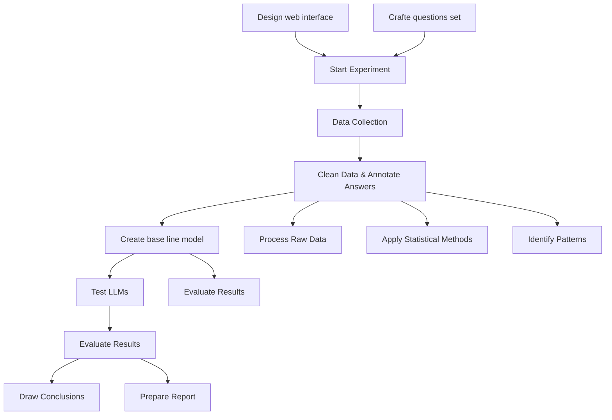

```mermaid
flowchart TD
    A["Start Experiment"] --> B["Data Collection"]
    B --> C["Clean Data & Annotate Answers"]
    C --> D["Create base line model"]
    D --> E["Test LLMs"]
    D --> D1["Evaluate Results"]

    C --> B1["Process Raw Data"]
    C --> B2["Apply Statistical Methods"]
    C --> B3["Identify Patterns"]

    E --> E1["Evaluate Results"]
    E1 --> E2["Draw Conclusions"]
    E1 --> E3["Prepare Report"]

    %% Additional considerations
    F["Design web interface"] --> A
    G["Crafte questions set"] --> A
```
